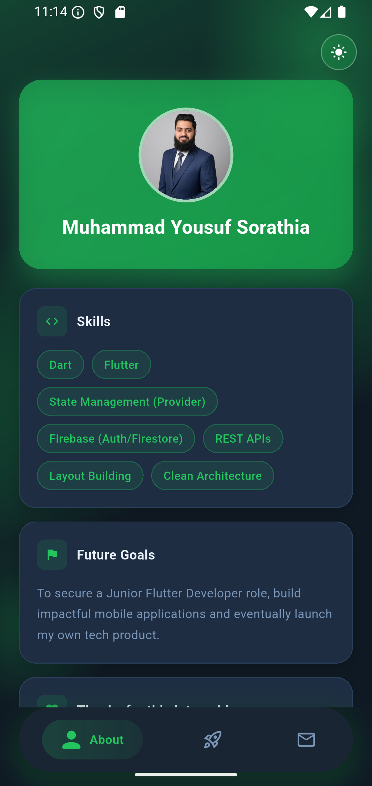
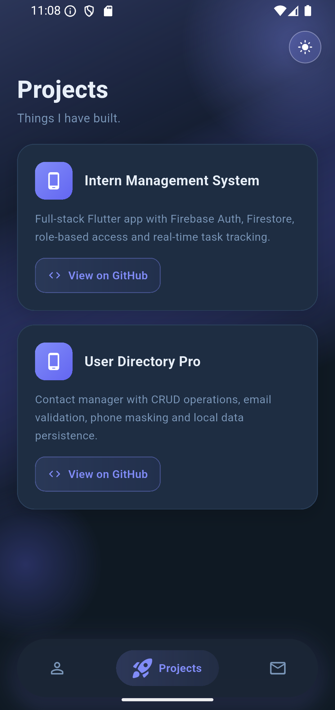
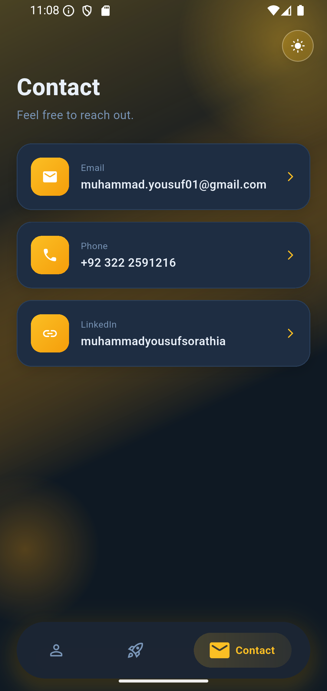

# My Intro

A personal portfolio Flutter app - built to showcase my introduction, projects and contact details. Profile data is fetched live from a REST API, making the app fully dynamic and easy to update without a code change.

---

## Features

- Live profile data fetched from [JSONBin](https://jsonbin.io) REST API
- Three-tab layout - About, Projects, Contact
- Animated gradient background that shifts per active tab
- Modern floating bottom navigation with icon scale animations
- Deep links - tap to email, call or open LinkedIn
- Light, Dark & System Default theme support with persistent preference
- Smooth fade and slide transitions between tabs
- Responsive layout for mobile, tablet & web

---

## Tech Stack

| Layer | Technology |
|---|---|
| Framework | Flutter |
| Language | Dart |
| Data Source | JSONBin REST API |
| HTTP Client | http package |
| Deep Links | url_launcher |
| State Management | Provider |
| Local Storage | SharedPreferences |

---

## Project Structure

```
lib/
├── config/
│   └── secrets.example.dart   # API key template - copy to secrets.dart
├── core/
│   └── constants/
│       ├── app_colors.dart
│       └── app_theme.dart
├── models/
│   └── profile_model.dart
├── providers/
│   └── theme_provider.dart
├── services/
│   └── api_service.dart
├── views/
│   ├── home_screen.dart
│   └── tabs/
│       ├── about_tab.dart
│       ├── projects_tab.dart
│       └── contact_tab.dart
├── widgets/
│   ├── info_card.dart
│   ├── info_row.dart
│   ├── chip_wrap.dart
│   └── contact_tile.dart
└── main.dart
```

---

## Getting Started

**Prerequisites**
- Flutter SDK 3.x
- A [JSONBin](https://jsonbin.io) account with a bin containing your profile data

**Setup**

```bash
git clone https://github.com/MuhammadYousuf12/my-intro.git
cd my-intro
flutter pub get
```

Copy the secrets template and add your own API key:

```bash
cp lib/config/secrets.example.dart lib/config/secrets.dart
```

Then open `secrets.dart` and replace the placeholder with your JSONBin API key.

```bash
flutter run
```

---

## Screenshots

| About | Projects | Contact |
|---|---|---|
|  |  |  |

---

## Author

**Muhammad Yousuf Sorathia**
Flutter Developer | Karachi, Pakistan

[LinkedIn](https://linkedin.com/in/muhammadyousufsorathia) · [GitHub](https://github.com/MuhammadYousuf12)

---

*Part of an active Flutter development portfolio*